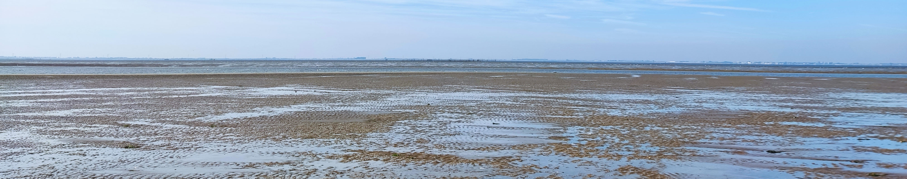

  <!-- Banner image placeholder -->
  

  <!-- Badges -->
  
  

## 👋 About Me

I study how **environmental variability** shapes **benthic ecosystems** on tidal flats.  
My research integrates **ecology, experiments, and mechanistic modelling**, focusing on:

- 🔥 Thermal stress & marine heatwaves  
- ⚙️ Behaviour–sediment coupling under fluctuating environments  
- 🦪 Bioturbation and sediment stability
- 🌊 Tidal-flat morphodynamics  

---

## 🌱 Current Research

- How **thermal stress alters the bioturbation process**  
- Response variability in benthic invertebrates  
- Behaviour–sediment feedbacks under temperature variability  
- Experimental + statistical modelling approaches to marine heatwaves  

---

## 🤝 Collaboration Interests

I’m open to contributing to projects involving:

- Thermal physiology & benthic behaviour  
- Bioturbation & sediment stability  
- Heatwave modelling approaches  
- Environmental variability & ecological resilience  

---

## 📫 Contact

- Email: **zhouzhengquan@outlook.com**
- 

---

## 🎞️ Behaviour Demos

| Cockle bioturbation | Sea urchin metamorphosis |
|-------|--------|
|  |  |

---

## 📚 Featured Publications

---

### 2025
**Zhou, Z.**, Fivash, G. S., Cozzoli, F., Walles, B., Troost, K., Ysebaert, T., & Bouma, T. J. (2025).  
**Compound extreme events reshuffle the stacked odds in the gamble between native and introduced bivalves.**  
*Global Ecology and Conservation*, e03918.  

---

### 2024
**Zhou, Z.**, Grandjean, T. J., de Smit, J., van Belzen, J., Fivash, G. S., Walles, B., Beauchard, O., van Dalen, J., Blok, D. B., van IJzerloo, L., *et al.* (2024).  
**Sediment dynamics shape macrofauna mobility traits and abundance on tidal flats.**  
*Limnology and Oceanography*, 69(10), 2278–2293.  

---

### 2023
**Zhou, Z.** (2023).  
**Benthic macrofauna under extremes: Unraveling response strategies from individual behavior to community structure in tidal flats.**  
PhD Thesis, Utrecht University.  

**Zhou, Z.**, Steiner, N., Fivash, G. S., Cozzoli, F., Blok, D. B., van IJzerloo, L., van Dalen, J., Ysebaert, T., Walles, B., & Bouma, T. J. (2023).  
**Temporal dynamics of heatwaves are key drivers of sediment mixing by bioturbators.**  
*Limnology and Oceanography.*  

---

### 2022
**Zhou, Z.**, Bouma, T. J., Fivash, G. S., Ysebaert, T., van IJzerloo, L., van Dalen, J., van Dam, B., & Walles, B. (2022).  
**Thermal stress affects bioturbators’ burrowing behavior: A mesocosm experiment on common cockles (*Cerastoderma edule*).**  
*Science of the Total Environment*, 824, 153621.  

